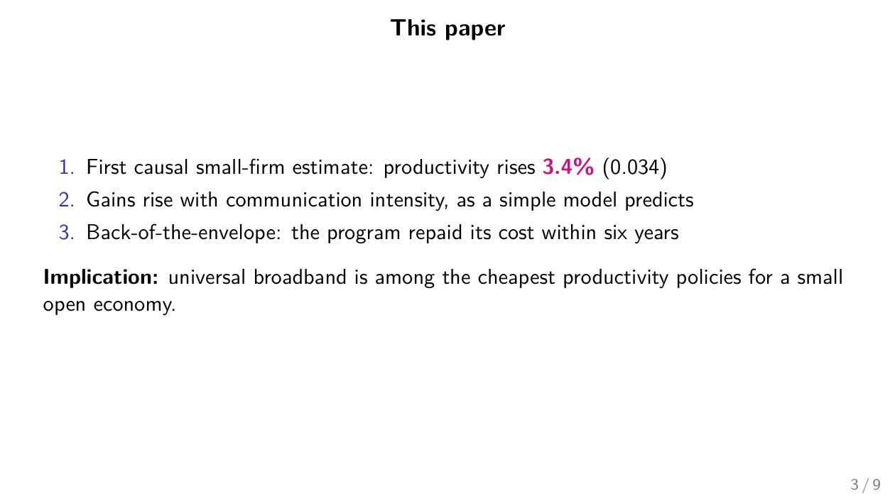
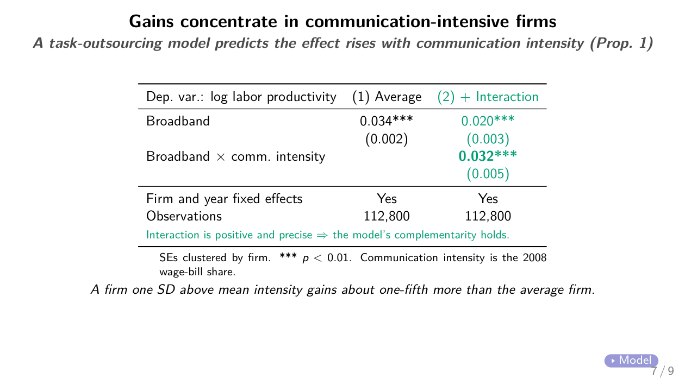

# Econ Slides Skill

**Turn your economics paper into a professional Beamer talk — one that would not embarrass you at a top seminar.**

[](LICENSE)
[](#install)
[](#install)

`econ-slides` is an Agent Skill for Claude Code and Codex. AI-generated slides usually fail twice: the layout is messy (wrapped titles, overflowing boxes, walls of bullets), and the talk itself has no craft (no punchline, pasted paper tables, a literature review nobody asked for). This skill fixes both. It encodes how economists actually give talks — synthesized from the canonical guides by Jesse Shapiro, Rachael Meager, Paul Goldsmith-Pinkham, John Cochrane, Dick Startz, Marc Bellemare, and Monika Piazzesi — and it verifies every deck by compiling it, measuring the rendered geometry, and looking at every page before delivery.

*Built for economics. Works for any research talk built on evidence, models, and regression tables.*

## What it does

- **Paper → talk.** Give it your manuscript and a clock ("15-minute conference talk", "90-minute job talk") and get a complete deck: motivation with a hook, the punchline by slide 4, surgically rebuilt exhibits, a linked appendix for every "what about…".
- **Discussant decks.** A first-class genre, not an afterthought: one-slide summary, two to three titled comments (the title *is* the comment), each ending in a concrete suggestion — built to the Dallas Fed / ASHEcon discussant norms.
- **Polish an existing deck.** Enforces the rules on your own slides: one-line titles and bullets, density limits, table surgery, semantic color.
- **Retarget a venue.** The same paper at 15 and 90 minutes is two different talks, not one deck played fast. The skill cuts by craft rules, not proportionally.

## What makes the decks trustworthy

1. **Number provenance.** Every coefficient, standard error, and magnitude on a slide is traced to its table and page in your paper — tagged in source comments, never invented, never re-rounded into fiction. The deck cannot misquote your own paper.
2. **One-line discipline.** Frame titles and bullets never wrap. Fixed by rewriting — not by shrinking fonts — and then verified geometrically on the rendered PDF.
3. **Slide tables are not paper tables.** Regression tables are rebuilt: key rows only, controls collapsed to indicator lines, the load-bearing column highlighted, the economic magnitude translated ("one SD ⇒ 0.7%") under the exhibit.
4. **A real verification loop.** `compile_deck.py` compiles and triages errors; `check_deck.py` measures the rendered pages (edge overflow, wrapped titles and bullets, bullet density, overlay abuse) and scores the deck — it ships at ≥ 90 plus a page-by-page visual pass.

## See it

Two slides from the [sample deck](docs/sample-talk/) — a 15-minute conference talk built cold by an agent following `SKILL.md`, from a manuscript PDF alone, finishing at a verification score of 100:

| The punchline slide | A surgically rebuilt table |
|---|---|
|  |  |

**[Browse the full sample deck →](docs/sample-talk/)** — PDF, LaTeX source, and the structure plan the skill wrote before drafting. (The underlying manuscript is the fictional demonstration paper from [econ-paper-review-skill](https://github.com/hanlulong/econ-paper-review-skill); see the sample's [provenance notes](docs/sample-talk/README.md).)

## Install

Requires Python 3.10+, a TeX distribution with XeLaTeX (TeX Live / MacTeX / MiKTeX), and PyMuPDF (`pip install pymupdf`).

Paste this into Claude Code or Codex:

```text
Help me install the econ-slides skill from
https://github.com/hanlulong/econ-slides-skill: clone it and register it as
an Agent Skill for my client (for Claude Code, place or link the folder under
~/.claude/skills/econ-slides). Verify python3 and xelatex are available and
pymupdf is installed, then confirm the skill loads.
```

<details>
<summary>Manual installation</summary>

```bash
git clone https://github.com/hanlulong/econ-slides-skill.git
# Claude Code (global): link it into your skills directory
ln -s "$(pwd)/econ-slides-skill" ~/.claude/skills/econ-slides
pip install pymupdf
```

Any agent that reads `SKILL.md` can use the skill; the scripts and themes are
plain Python and LaTeX with no other dependencies.

</details>

## Use it

Put your paper (PDF, plus LaTeX source if you have it) in the working directory and ask:

```text
Use the econ-slides skill to make a 15-minute conference talk from this paper.
Use the econ-slides skill to build my discussion of the attached paper for a 10-minute slot.
Use the econ-slides skill to turn my 90-minute seminar deck into a 20-minute version for SED.
Use the econ-slides skill to fix the layout of my slides without changing the content.
```

The skill will show you the slide plan (frame titles and exhibits) before drafting, then deliver the `.tex`, the compiled PDF, and a note on where every headline number came from.

## Themes

Three bundled looks, one semantic interface — a finished deck switches themes by changing one `\usepackage` line:

| Theme | Look | For |
|---|---|---|
| `econ-slides-house` *(default)* | No chrome, centered assertion titles, Palatino math, Okabe–Ito palette | Research talks |
| `econ-slides-clean` | Near-monochrome, left titles over a thin rule | Zero visual signature |
| `econ-slides-boxed` | Navy title bar, structured blocks | Discussions, policy audiences |

Institutional template? Copy a bundled `.sty`, swap its look, keep the interface block — the deck's content never changes. See [themes/README.md](themes/README.md).

## What's inside

```
SKILL.md                 the workflow: intake → read → plan → draft → verify → deliver
references/
  talk-structures.md     arcs and slide budgets: conference, seminar, job talk; cut order
  discussant.md          the discussion genre: skeleton, time budgets, tone rules
  slide-rules.md         layout law: titles, bullets, overlays, math, color, anti-AI tells
  exhibit-surgery.md     regression table → slide table; figures; number provenance
  style-guide.md         themes, file engineering, build and delivery conventions
themes/                  three .sty files + the semantic interface contract
templates/               paper-talk.tex and discussion.tex starting points
scripts/
  compile_deck.py        XeLaTeX compile loop with error triage
  check_deck.py          geometry-measured layout audit with a numeric score
  crop_figure.py         crop a paper figure for slide use (when no source exists)
tests/                   interface test (all themes) + a deliberately broken deck
```

## What it does not do

It will not write your paper's content, invent a number that is not in your materials, or promise results your paper does not contain. It also will not put a literature review on your slides — the craft corpus is unanimous on that.

## Related projects

- [econ-paper-review-skill](https://github.com/hanlulong/econ-paper-review-skill) — the referee-report sibling: that skill judges the paper, this one presents it
- [econ-writing-skill](https://github.com/hanlulong/econ-writing-skill) — writing the paper in the first place
- [awesome-ai-for-economists](https://github.com/hanlulong/awesome-ai-for-economists) — the broader toolbox

## Acknowledgments

The craft rules synthesize public guides by Jesse Shapiro, Rachael Meager, Paul Goldsmith-Pinkham, John Cochrane, Dick Startz, Marc Bellemare, Monika Piazzesi, Alex Tabarrok, David Evans, Darren Lubotsky, Donald Davis, Keith Head, and the Dallas Fed and ASHEcon discussant guides. The verification approach learns from [beamer-skill](https://github.com/Noi1r/beamer-skill) (PDF-render visual auditing) and [Pedro Sant'Anna's workflow](https://github.com/pedrohcgs/claude-code-my-workflow) (executable quality gates); TikZ placement rules adapt ideas from Scott Cunningham's MixtapeTools. All adapted material is reimplemented; sources are MIT/CC0.

## License

MIT — see [LICENSE](LICENSE).

---

If this skill saves you a slide-panic night before a seminar, star the repo so other economists find it — and if it produces an ugly or dishonest slide, open an issue. Bad slides are bugs here.
